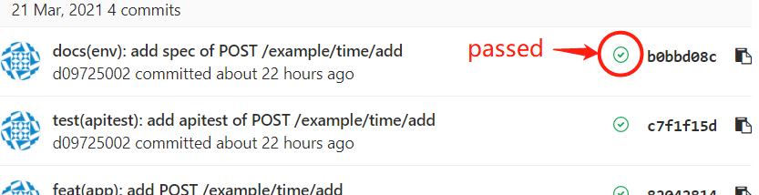
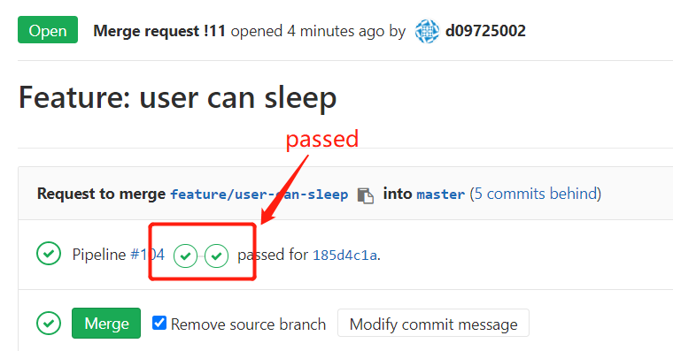

# Backend services of project MeetLangLang

## Members

### `Group3` of course "Software Development Methods, Spring 2021"

- R09725017@ntu.edu.tw 謝欣珊
- R09725030@ntu.edu.tw 吳雨澤
- R09725042@ntu.edu.tw 張古宜
- R09725064@ntu.edu.tw 游芮瑜
- R09922168@ntu.edu.tw 何泰良
- D09725002@ntu.edu.tw 林耕葆

# :zap: Setup

Ubuntu 18.04 is recommended.

## System requirements

- Docker

```
$ curl -fsSL https://get.docker.com -o get-docker.sh
$ sudo sh get-docker.sh
$ sudo usermod -aG docker $USER
$ sudo reboot
```

- Docker-Compose

```
$ sudo curl -L "https://github.com/docker/compose/releases/download/1.25.4/docker-compose-$(uname -s)-$(uname -m)" -o /usr/local/bin/docker-compose
$ sudo chmod +x /usr/local/bin/docker-compose
$ sudo ln -s /usr/local/bin/docker-compose /usr/bin/docker-compose
```

# :zap: Launch

## Start services

```
$ ./tools/dev-start.bash
```

If services were started, you can try API by accessing `http://localhost:8181/example/hello`.<br/>
And you can manage the database by logging in `http://localhost:8080`.<br/>

Database info:

```
HOST: mll-mysql
USER: add
PASSWORD: mllapp
DB: mllapp
```

## Stop services

```
$ ./tool/dev-stop.bash
```

# :zap: Test

## Run standard test locally (e.g. coding style, commit message)

```
$ ./tool/dev-test-standard.bash
```

## Run api test locally

```
$ ./tool/dev-test-api.bash
```

# :zap: Contribution

## Make a feature

A feature is expected to through `app/api function`, `api doc`, `api test`, `db modification(optional)`

Some examples you can follow:
- [Feature: user can see hello message](https://gitlab.sdm.im.ntu.edu.tw/SDM2021-Group3/mll-backend/merge_requests/8)
- [Feature: user can add time into db](https://gitlab.sdm.im.ntu.edu.tw/SDM2021-Group3/mll-backend/merge_requests/9)
- [Feature: user can get time list from db](https://gitlab.sdm.im.ntu.edu.tw/SDM2021-Group3/mll-backend/merge_requests/10)

## Workflow

This project use `GitHub Flow` and `CI/CD`.

Here are examples:

```
$ git checkout master
$ git checkout -b feature/<example: user-can-login>
(Developing...)
$ git push --set-upstream origin feature/<example: user-can-login>
```

Then go GitLab to check the latest commit is passed the CI checks.<br/>
If your **commits** are **not passed**, please revise and re-push.<br/>
If your **commits** are **passed**, you can add new `Merge Request` and **Refresh page to wait new tests**.<br/>



If your **Merge Request** is **not passed**, DO NOT merge, please revise and re-push.<br/>
If your **Merge Request** is **passed**, then you can merge.



## Commit messages

This project has a rule of commit messages (following [Semantic Commit Messages](https://gist.github.com/joshbuchea/6f47e86d2510bce28f8e7f42ae84c716)):

An example:

```
test(apitest): new testcase of GET /example/hello
```

Defined types:

```
feat: (new feature for the user, not a new feature for build script)
fix: (bug fix for the user, not a fix to a build script)
docs: (changes to the documentation)
style: (formatting, missing semi colons, etc; no production code change)
refactor: (refactoring production code, eg. renaming a variable)
test: (adding missing tests, refactoring tests; no production code change)
chore: (updating grunt tasks etc; no production code change)
```

Defined scope:

```
app: (related to app)
db: (related to db)
apitest: (related to apitest)
env: (this commit is crossed multiple scopes)
```
